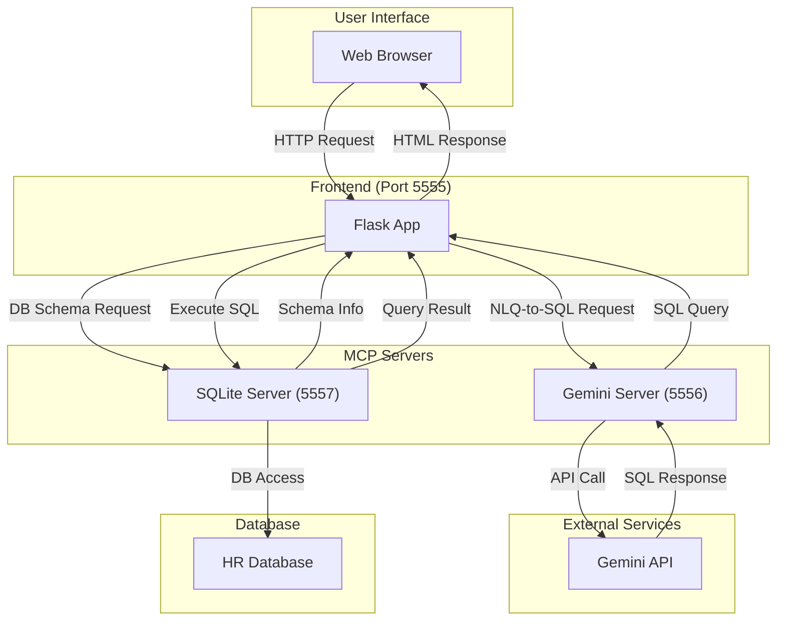

# Natural Language to SQL Query with MCP Architecture

This project is a microservices-based Flask application that converts natural language questions into SQL queries. It uses the Model Context Protocol (MCP) architecture to separate concerns between the Gemini API service and SQLite database service.

## Project Structure

```
nl2sql_mcp/
├── backend/
│   ├── app.py              # Main Flask application
│   └── requirements.txt    # Python dependencies
├── db/
│   ├── hr.db              # SQLite database
│   └── init.sql           # Database initialization script
├── frontend/
│   └── templates/
│       └── index.html     # Web interface template
└── mcp/
    ├── gemini_server/
    │   └── server.py      # Gemini MCP implementation
    └── sqlite_server/
        └── server.py      # SQLite MCP implementation
```

## Architecture



### MCP Server Details

#### 1. Gemini MCP Server (Port 5556)
- **Endpoint**: `/nl2sql`
- **Method**: POST
- **Input**:
  ```json
  {
    "question": "Natural language question",
    "schema": "Database schema description"
  }
  ```
- **Output**:
  ```json
  {
    "sql": "Generated SQL query",
    "status": "success"
  }
  ```
- **Features**:
  - Natural Language to SQL conversion
  - Context-aware query generation
  - Schema-based validation
  - Error handling with detailed messages

#### 2. SQLite MCP Server (Port 5557)
- **Endpoints**: 
  1. `/schema` (GET)
     ```json
     {
       "schema": "Table descriptions",
       "status": "success"
     }
     ```
  2. `/query` (POST)
     - Input:
       ```json
       {
         "sql": "SQL query to execute"
       }
       ```
     - Output:
       ```json
       {
         "result": ["Query results"],
         "columns": ["Column names"],
         "status": "success"
       }
       ```
- **Features**:
  - Schema introspection
  - Query execution
  - Result formatting
  - Error handling with SQL-specific details

## Key Benefits of MCP Architecture

### 1. Schema Flexibility
The system is completely database-schema agnostic. You can change the database structure without modifying any code:
- SQLite MCP automatically discovers tables and columns
- Gemini MCP adapts to any schema description
- UI dynamically updates to show new schema
- Only need to update `init.sql` and recreate `hr.db`

### 2. Separation of Concerns
Each service has a specific responsibility:
- Main App (5555): User interface and service coordination
- Gemini MCP (5556): Natural language to SQL conversion
- SQLite MCP (5557): Database operations and schema management

### 3. Standardized Interfaces
Clear, well-defined JSON API endpoints:
```
Gemini MCP:
POST /nl2sql
Request: {"question": "...", "schema": "..."}
Response: {"sql": "...", "status": "success"}

SQLite MCP:
GET /schema
Response: {"schema": "...", "status": "success"}

POST /query
Request: {"sql": "..."}
Response: {"result": [...], "columns": [...], "status": "success"}
```

### 4. Enhanced Maintainability
- Independent scaling of services
- Isolated testing of components
- Clear error handling per service
- Easy to add new features or services

## Components

The application consists of three main components:

1. **Main Application** (Port 5555)
   - Web interface for user interaction
   - Coordinates between Gemini and SQLite services
   - Displays results in a user-friendly format

2. **Gemini MCP Server** (Port 5556)
   - Handles natural language to SQL conversion
   - Communicates with Google's Gemini API
   - Provides a standardized JSON API endpoint

3. **SQLite MCP Server** (Port 5557)
   - Manages database operations
   - Provides schema information
   - Executes SQL queries
   - Returns results in a standardized format

## Features

- Convert natural language questions to SQL queries using Gemini API
- Execute SQL queries against SQLite database
- Interactive data visualization dashboard with multiple chart types:
  - Bar charts
  - Line charts
  - Pie charts
- Automatic data visualization based on query results
- Display results in both table and chart formats
- Dynamic schema reference interface
- Microservices architecture for better scalability and maintenance
- Standardized JSON API endpoints

## Schema

The database contains the following tables:

- `employees` (employee_id, first_name, last_name, email, hire_date, job_id, department_id, salary)
- `departments` (department_id, department_name)
- `jobs` (job_id, job_title)

## Setup

1. **Clone the repository:**
   ```bash
   git clone <repository-url>
   cd <repository-directory>
   ```

2. **Install dependencies:**
   ```bash
   python3 -m pip install -r requirements.txt
   ```

3. **Initialize the database:**
   ```bash
   sqlite3 hr.db < init.sql
   ```

4. **Configure the API key:**
   Create a `.env` file in the root directory:
   ```
   GEMINI_API_KEY=your_gemini_api_key
   ```

## Running the Application

### Using the Start Script

The easiest way to run all components is using the provided start script:

1. Make sure you have tmux installed:
   ```bash
   brew install tmux   # For macOS
   # or
   sudo apt install tmux   # For Ubuntu/Debian
   ```

2. Run the start script:
   ```bash
   ./start.sh
   ```

This will:
- Start all three services in a tmux session
- Open a split view to monitor all services
- Automatically handle the correct startup order

Tmux Navigation:
- `Ctrl + b` then arrow keys: Switch between panes
- `Ctrl + b` then `d`: Detach from session
- `tmux attach -t nl2sql`: Reattach to session
- `Ctrl + b` then `x`: Kill a pane

### Manual Startup

Alternatively, you can start each component manually in separate terminals:

1. **Start SQLite MCP Server:**
   ```bash
   cd sqlite_server
   python3 server.py
   ```

2. **Start Gemini MCP Server:**
   ```bash
   cd gemini_server
   python3 server.py
   ```

3. **Start Main Application:**
   ```bash
   python3 app.py
   ```

Access the application at `http://localhost:5555`

## API Endpoints

### Gemini MCP Server (localhost:5556)
- `POST /nl2sql`
  - Convert natural language to SQL
  - Request body: `{"question": "string", "schema": "string"}`

### SQLite MCP Server (localhost:5557)
- `GET /schema`
  - Get database schema
- `POST /query`
  - Execute SQL query
  - Request body: `{"sql": "string"}`

## Screenshot


## How to Use

1.  Open your web browser and navigate to `http://localhost:5555`.
2.  You will see the main page with the database schema displayed.
3.  Enter a question about the HR data in the input box (e.g., "Who are the employees in the IT department?").
4.  Click "Submit" to process your question.
5.  The application will:
    - Convert your question to an SQL query
    - Execute the query
    - Display the results in a table
    - Generate an interactive visualization in the dashboard

### Dashboard Features

The dashboard automatically visualizes your query results:

1. **Chart Types**: Choose between:
   - Bar Chart: Great for comparing values across categories
   - Line Chart: Ideal for showing trends and patterns
   - Pie Chart: Perfect for showing proportions and distributions

2. **Automatic Data Processing**:
   - Numeric data is visualized directly
   - Categorical data shows count distributions
   - Grouped data is automatically aggregated

3. **Interactive Elements**:
   - Hover over data points to see exact values
   - Click legend items to show/hide data series
   - Switch between chart types in real-time

### Example Queries

Try these queries to see different visualization types:

1. Distribution Analysis:
   ```
   Show the number of employees in each department
   ```

2. Salary Analysis:
   ```
   What is the average salary by department?
   ```

3. Job Distribution:
   ```
   How many employees are there in each job role?
   ```

4. Temporal Analysis:
   ```
   Show the number of employees hired each year
   ```
